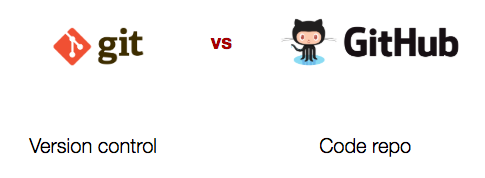

# M5: Git and GitHub

###Learning Objectives

- Describe what version control is
- Create a GitHub account
- Create a repo
- Publish a webpage using GitHub Pages

###Git and GitHub

**Read** <https://www.howtogeek.com/180167/htg-explains-what-is-github-and-what-do-geeks-use-it-for/> to learn more about what git and GitHub are and what's the difference between them.

Be prepared to explain it in your own words before next class.

**Explore** <https://www.youtube.com/user/GitHubGuides>

Use this as a resource if you get stuck or want to learn more outside of class.

### Version Control

Class discussion.

### Git VS GitHub: what’s the difference?

### Getting Started

1. Go to [github.com](https://github.com/) and create an account.
2. Check your email to confirm your account.

### Publishing your first page

1. Create a new project with the name YOUR_USER_NAME.github.io (replace YOUR_USER_NAME with the username that you created for GitHub)

   1. Right now you should be in your project page. The URL will be something like https://github.com/YOUR_USER_NAME/YOUR_USER_NAME.github.io. The URL for any of your projects on GitHub will always follow this format: https://github.com/YOUR_USER_NAME/YOUR_REPO_NAME

2. Open GitHub Desktop.

   1. Go to File >> Clone Repository...
   2. Select the YOUR_USER_NAME.github.io repository, then click in Local Path >> Choose... and select Desktop. Click "Clone"

3. This should have created a new folder in your Desktop with the same name as the repository you just created. Copy your about_me.html page into this folder.

4. Open Brackets and select this newly created folder containing your about_me page.

   1. Create a new file called index.html

   2. Add the basic html skeleton (look back on Module 2 if you need a refresher)

   3.  Create a link to your about_me page. The code is below:

      `<a href="about_me.html">Click here to learn more about me</a>`

5. Commit your changes.

   1. On GitHub Desktop, you'll see all of the files that you edited.
   2. On the bottom left of the page, you'll see your picture and "Summary"
   3. Write "Initial Commit" in the Summary field.
   4. Click "Commit to master"
   5. On the top, click "Push" and Publish branch.

6. Go back to your repository on GitHub (it should be something like https://github.com/YOUR_USER_NAME/YOUR_USER_NAME.github.io)

   1. Go to Settings >> GitHub Pages
   2. In Source, select "master branch" and click "Save"

7. Open a browser and go to YOUR_USER_NAME.github.io. Voila!

8. Post the link to your webpage in the discussion below.

### Your first GitHub Page

Submit the link to your first page and share with the class.

### Add a link to your Adventure Game

You should have two repositories in GitHub, one for your personal page (https://github.com/YOUR_USER_NAME/YOUR_USER_NAME.github.io) and one for your adventure game (https://github.com/USER_NAME/REPO_NAME).

1. First, go to your Adventure Game repo on GitHub (https://github.com/USER_NAME/REPO_NAME).
2. Go to Settings >> GitHub Pages
3. In Source, select "master branch" and click "Save" (from now on, this is all you have to do to publish a page on GitHub pages. Just go to that repository and tell GitHub where to "serve the files" from.)
4. Navigate to YOUR_USER_NAME.github.io/REPO_NAME. Your adventure game is now live on the web! You can send this link to anyone and they'll be able to play it.

Next, we need to add a link to your adventure game in the main page (that's the index.html in the YOUR_USER_NAME.github.io repository). Can you figure out how to do that?

**Challenge: Add a link to your adventure game in your YOUR_USER_NAME.github.io repo.**

Hint 1: This is similar to how we added a link to your about_me page.

Hint 2: Once you have a published GitHub Page, all you need to do to update it is push your changes. No need to "re-publish" or anything.